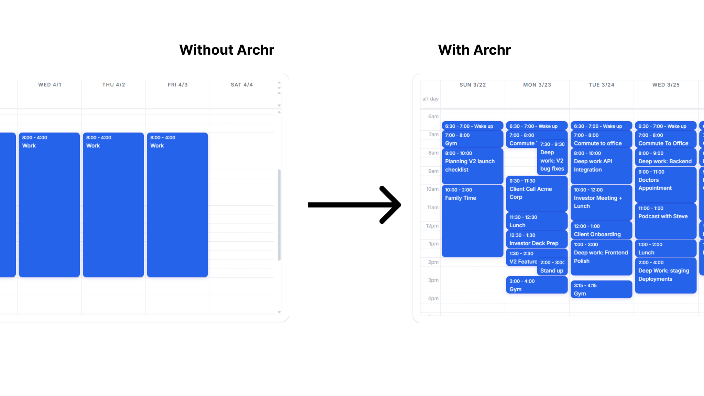
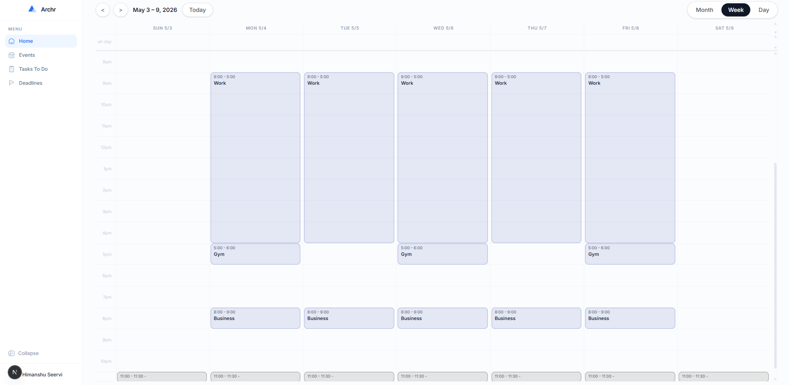
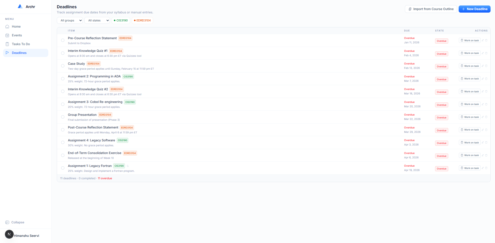
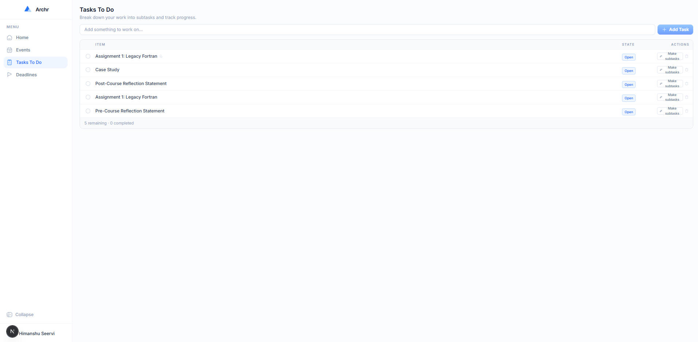
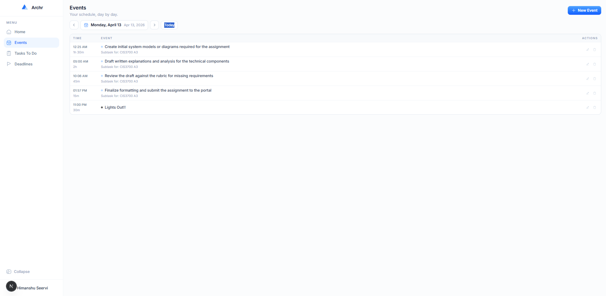

<div align="center">
  
  <h1>Archr</h1>
  <p><strong>AI-powered calendar and task manager built for students and knowledge workers.</strong><br/>Stop manually reshuffling your week — Archr syncs with Google Calendar, breaks down your assignments with AI, and schedules everything for you.</p>

  <p>
    <a href="https://tryarchr.com" target="_blank"></a>
    &nbsp;
    
    &nbsp;
    
    &nbsp;
    
    &nbsp;
    
  </p>
</div>

---

## The Problem

Students and professionals lose hours every week manually managing their schedule. When a meeting moves, a deadline shifts, or a new assignment drops — you're back to shuffling tasks by hand. Most calendar apps just store events; they don't help you think.

**Archr fixes this.** It connects to your Google Calendar, lets you track deadlines from your syllabus or course page, breaks down assignments into actionable subtasks using AI, and books those subtasks directly into your calendar — all in one place.

---

## What it looks like

### Landing Page


### Calendar View — full weekly overview synced with Google Calendar


### Deadlines — track every due date, import from your course page with one click


### Tasks To Do — AI breaks down your assignments into subtasks, then schedules them


### Events — day-by-day view of your Google Calendar events


---

## Features

### Google Calendar Two-Way Sync
Archr connects to your Google Calendar via OAuth. Every event you create, edit, or delete in Archr is immediately reflected in Google Calendar and vice versa. Events show color-coded by Google's calendar color system.

### AI Subtask Generation
Paste an assignment description or upload a PDF/Word doc, and Archr's Gemini-powered AI breaks it down into 4–8 specific, ordered subtasks — each with a realistic time estimate. For example, a "Legacy Fortran Assignment" becomes:
- Research F77/F90 syntax — 60 min
- Design data structure — 45 min
- Write main program loop — 90 min
- ...and so on

### Schedule Subtasks to Calendar
After subtasks are generated, a single click opens a scheduling modal. Pick your start time, preview the back-to-back timeline, and hit **Add to Calendar** — all subtasks are booked as individual Google Calendar events instantly.

### Deadline Tracker
Never lose track of a due date. Add deadlines manually or use the **Import from Course** feature — paste a URL to your Canvas/course page or paste your syllabus text directly, and Gemini extracts every deadline automatically. Deadlines can be tagged with a course color (e.g. `CIS2700` in blue), filtered, and moved to your task list with one click.

### Day-by-Day Event View
Browse your schedule one day at a time with forward/back navigation. Each event shows its time, duration, and color. Create or edit events with AI metadata fields — recurrence, travel time, priority, and whether the AI can reschedule it.

### Auth & Protected Routes
Sign up and log in with email/password via Supabase Auth. All dashboard routes are server-side protected — unauthenticated users are redirected to `/login` automatically via Next.js middleware.

---

## Tech Stack

| Layer | Technology |
|---|---|
| Framework | Next.js 16 (App Router), React 19 |
| Language | TypeScript 5 |
| Styling | Tailwind CSS v4 |
| Auth + Database | Supabase (Auth, Postgres, Storage) |
| Calendar | Google Calendar API v3 |
| AI | Google Gemini API (`gemini-3-flash-preview`) |
| Calendar UI | FullCalendar |
| Icons | HugeIcons |
| Analytics | PostHog |
| Deployment | Vercel |

---

## Architecture

```
archr/
├── app/
│   ├── page.tsx                          # Landing page
│   ├── dashboard/page.tsx                # Protected dashboard shell
│   ├── login/ & signup/                  # Auth pages
│   ├── onboarding/connect-calendar/      # Google Calendar OAuth flow
│   └── api/
│       ├── ai/subtasks/                  # Gemini subtask generation
│       ├── ai/extract-deadlines/         # Gemini deadline extraction from syllabus
│       ├── ai/schedule-subtasks/         # Smart scheduling endpoint
│       ├── google/events/                # Google Calendar CRUD
│       └── user-events/                  # Supabase event metadata store
├── components/
│   ├── dashboard/
│   │   ├── Dashboard.tsx                 # Home overview
│   │   ├── CalendarView.tsx              # FullCalendar week view
│   │   ├── Events.tsx                    # Day-by-day event list
│   │   ├── Tasks.tsx                     # Tasks + AI subtasks + calendar scheduling
│   │   ├── Deadlines.tsx                 # Deadline tracker + import modal
│   │   └── Sidebar.tsx                   # Navigation
│   └── landing/                          # Hero, Features, Pricing, FAQ, Navbar
├── lib/
│   ├── supabase/                          # Client, server, middleware helpers
│   └── google-calendar-server.ts         # Token refresh + Google API wrapper
└── middleware.ts                          # Route protection (dashboard, onboarding)
```

---

## Running Locally

```bash
git clone https://github.com/HimanshuS10/Archr.git
cd Archr/archr
npm install
```

Create a `.env.local` file:

```env
NEXT_PUBLIC_SUPABASE_URL=your_supabase_url
NEXT_PUBLIC_SUPABASE_ANON_KEY=your_supabase_anon_key
GEMINI_API_KEY=your_gemini_api_key
GOOGLE_CLIENT_ID=your_google_client_id
GOOGLE_CLIENT_SECRET=your_google_client_secret
NEXT_PUBLIC_SITE_URL=http://localhost:3000
```

Then:

```bash
npm run dev
```

Open [http://localhost:3000](http://localhost:3000).

> **Google Calendar setup:** In Google Cloud Console, enable the Google Calendar API and add `http://localhost:3000/auth/callback` as an authorised redirect URI. In Supabase, enable Google as an OAuth provider using the same client ID and secret.

---

## Why I Built This

Managing a full course load means juggling deadlines from 5+ courses, meetings, and personal goals — all in separate apps. I wanted a single tool that understood the *academic* workflow: import your syllabus, get your subtasks, and have your week planned automatically. Archr is that tool.

---

<div align="center">
  <p>Built by <a href="https://github.com/HimanshuS10">Himanshu Seervi</a> · <a href="https://tryarchr.com">tryarchr.com</a></p>
</div>
